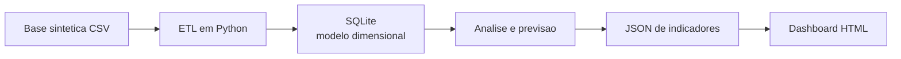
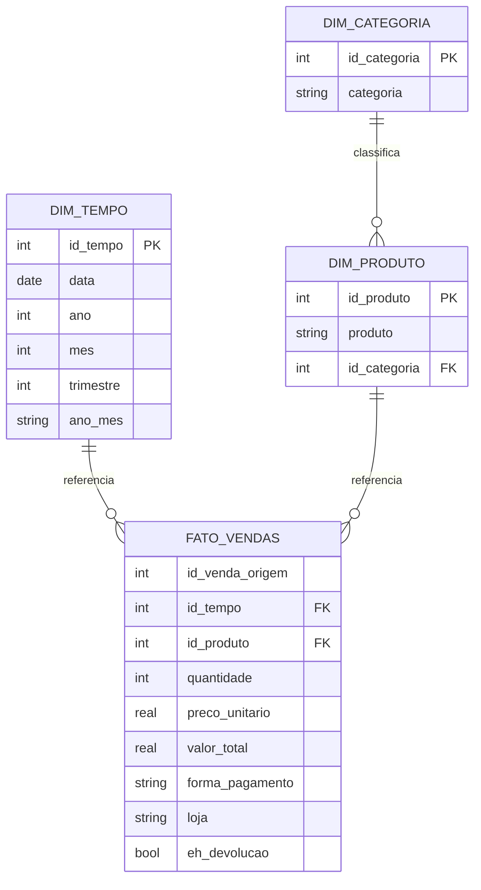

# Arquitetura do projeto

## Fluxo do pipeline

## Modelo dimensional

A tabela fato se relaciona diretamente com tempo e produto. A categoria permanece em uma tabela propria ligada a produto. Por isso, a implementacao e descrita como modelo dimensional parcialmente normalizado, com caracteristica de floco de neve.
